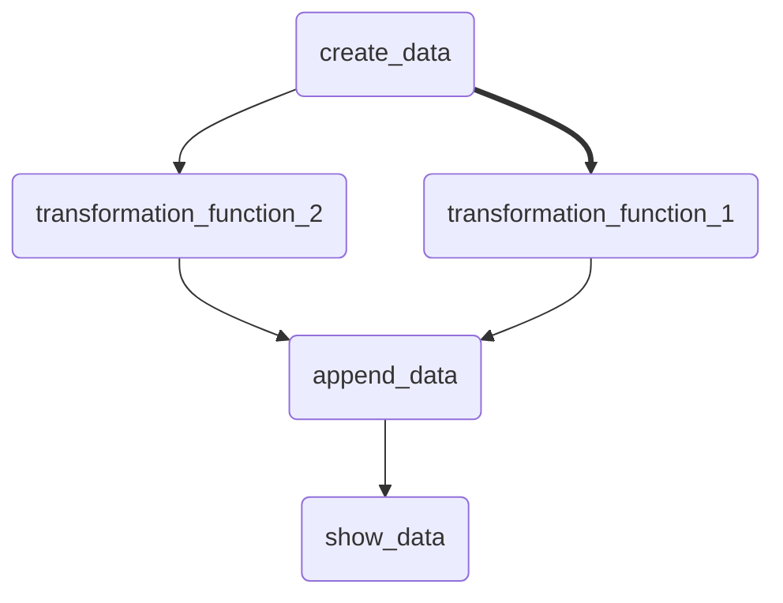

```mermaid
graph TD;
    id("create_data") ==> id2("transformation_function_1")
    id("create_data") --> id3("transformation_function_2")
    id3("transformation_function_2") --> id4(append_data)
    id2("transformation_function_1") --> id4(append_data)
    id4(append_data) --> id5(show_data)
```
