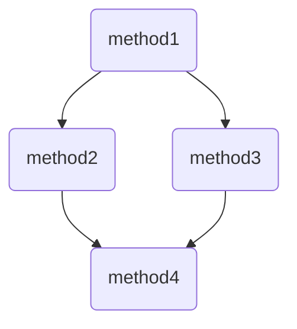

# flowrunner: A lightweight Data Engineering/Science Flow package

[](https://codecov.io/gh/prithvijitguha/FlowRunner)
&nbsp;
&nbsp;
&nbsp;
[](https://flowrunner.readthedocs.io/en/latest/?badge=latest)
[](https://www.python.org/downloads/release/python-390/)&nbsp;
[](https://github.com/psf/black)&nbsp;
[](https://pycqa.github.io/isort/)&nbsp;
[](https://github.com/pre-commit/pre-commit)

## What is it?
**flowrunner** is a lightweight package to organize and represent Data Engineering/Science workflows. Its designed to be
integrated with any pre-existing framework like pandas or PySpark

## Main Features
- Easy BaseFlow to build all Flows
- Simple decorators to convert methods to Flow `step`
- Run flows with CLI or python class methods

## Installing flowrunner
To install flowrunner, following commands will work

Source code is hosted at https://github.com/prithvijitguha/flowRunner

```sh
$ pip install git+https://github.com/prithvijitguha/flowRunner@main
```

## Usage

Here is a quick example to run as is

```python
# example.py
from flowrunner import BaseFlow, step, start, end

class ExampleFlow(BaseFlow):
    @start
    @step(next=['method2', 'method3'])
    def method1(self):
        self.a = 1

    @step(next=['method4'])
    def method2(self):
        self.a += 1

    @step(next=['method4'])
    def method3(self):
        self.a += 2

    @end
    @step
    def method4(self):
        self.a += 3
        print("output of flow is:", self.a)
```

You can run the flow with the following command
```console
$ python -m flowrunner run example.py
output of flow is: 7
```


## Display your flow

```python
ExampleFlow().display()
```




## Documentation
Check out the latest documentation here: [FlowRunner documentation](https://flowrunner.readthedocs.io/en/latest/)

## Contributing
All contributions are welcome :smiley:

If you are interested in contributing, please check out this page: [FlowRunner Contribution Page](https://flowrunner.readthedocs.io/en/latest/contributing_guide_code.html)
